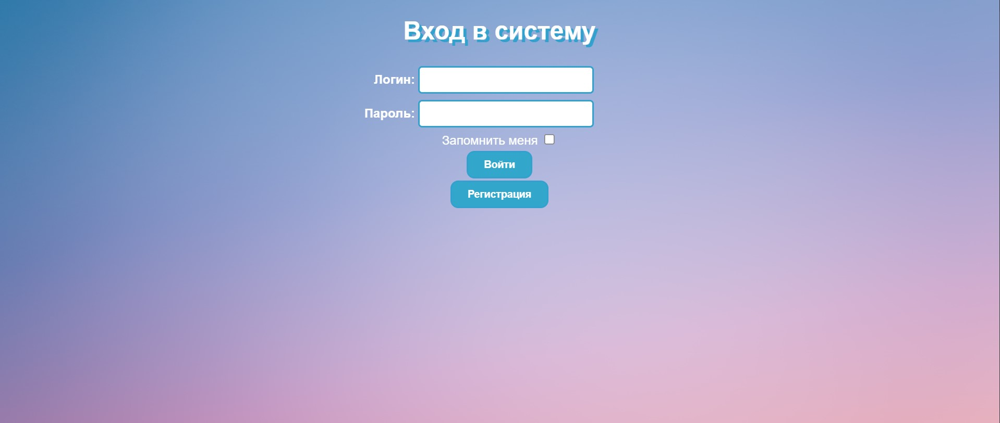
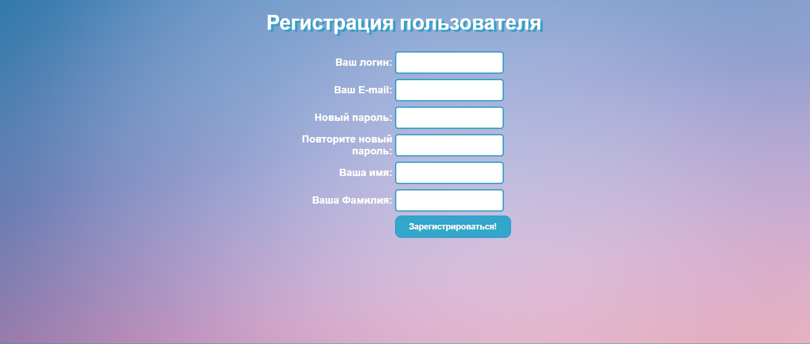
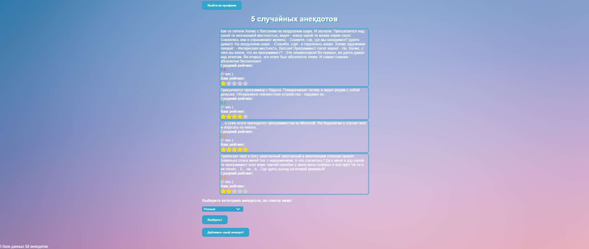
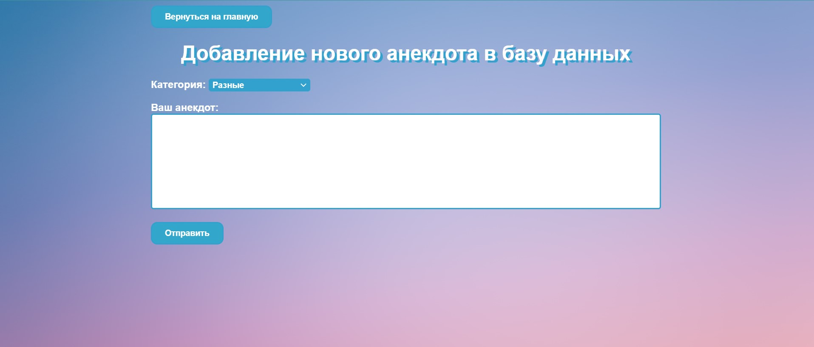
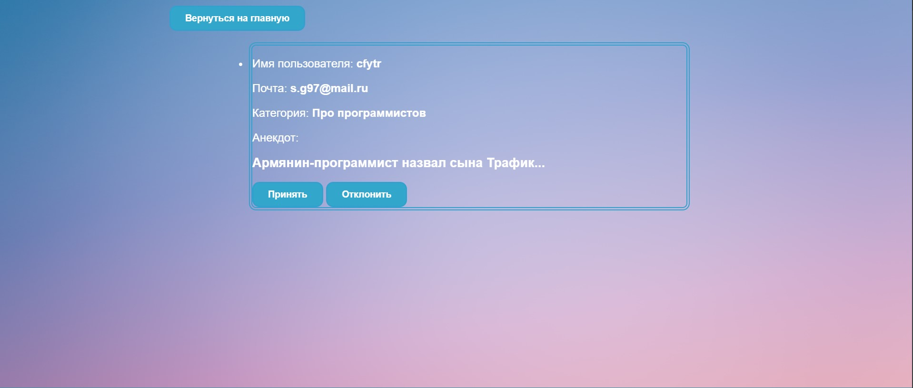

_____
A joke database site with **45** categories of jokes, totaling over **130,000** jokes!
_____
##  Possibilities. 
The site is implemented with pre-registration, in order to be able to:
+ joke ratings;
+ sending a new anecdote from the user for consideration by the administrator;
+ consideration of the joke by the administrator: 
  + to confirm the addition of a new joke;
  + to rejection the addition of a new joke.
_____

###  1. The first page of the site is the login.
+ On this page, the user can log in, or go to the registration page
+ to go to the page use the direct path /

###  2. Registration page. 
+ Filling in information: login, email, password, first name, last name
+ to go to the page use the direct path /registration/

###  3. Main page with anekdots from database. 
+ Contains jokes, with a choice of a category of jokes, 
with the ability to go to the page - adding a new joke, 
as well as a button to exit the profile;
+ With the ability to evaluate anecdote.
+ to go to the page use the direct path /anek/

###  4. Submission page for consideration of adding a new joke to the database. 
+ to go to the page use the direct path /new/

###  5. Admin page. 
+ The page is designed to review new jokes from users, with confirmation of adding a new joke to the database, 
or rejecting it. When reviewing a new joke, the administrator sees the sender's name, 
mail, category of the joke, and the joke itself.
+ To be able to go to this page, you need to access it by changing the user status in the database 
(in the project folder - aneks.db - Users table - column "administrator")
+ to go to the page use the direct path /admin/

##  Used frameworks and libraries: 
+ Flask;
+ WTF;
+ SQLAlchemy;
+ Flask-login;
+ Werkzeug;
+ Jinja2.
